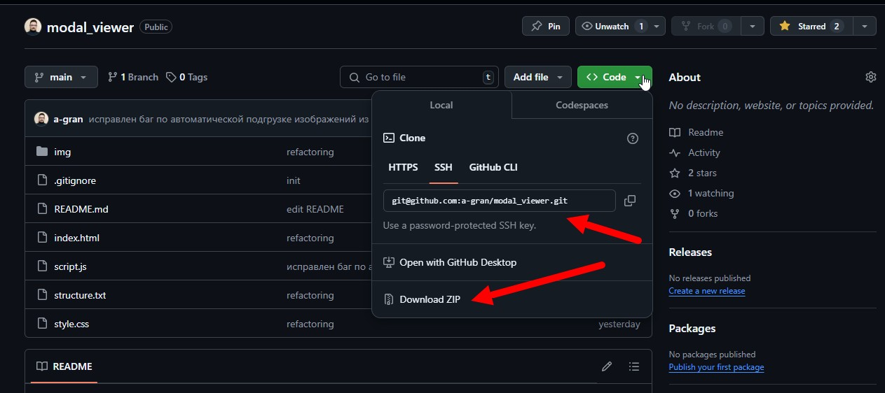
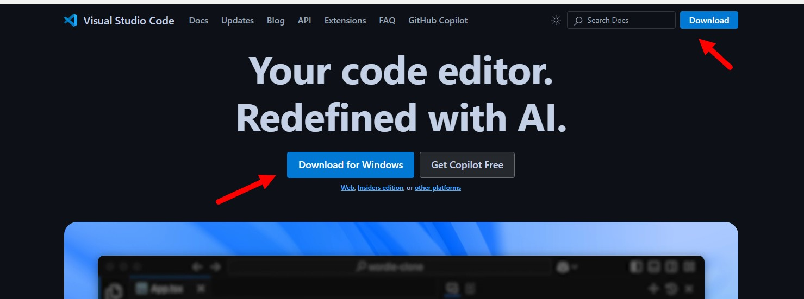
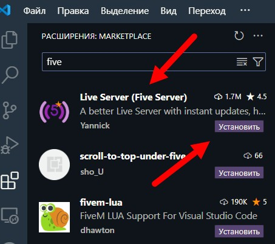
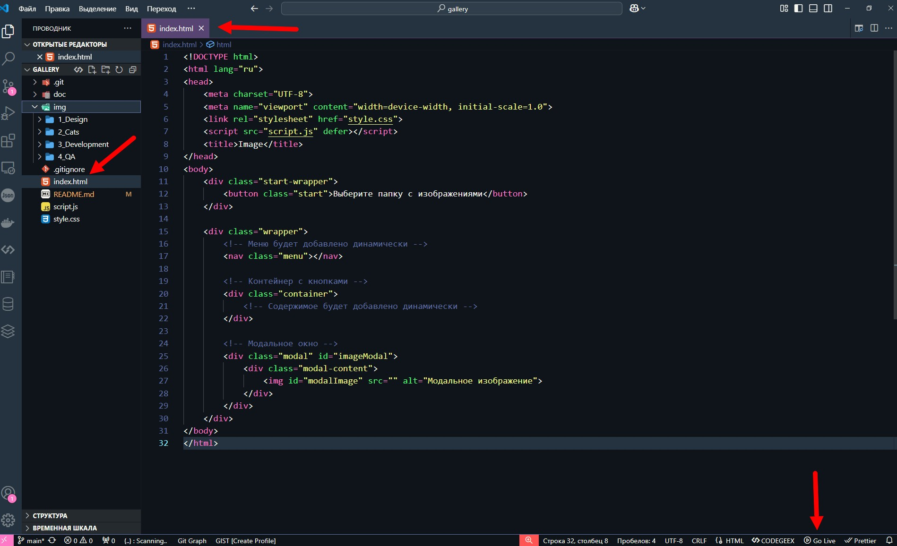
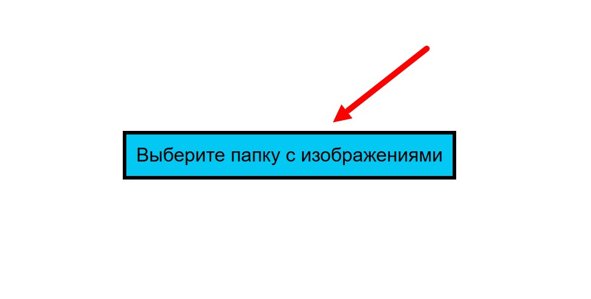
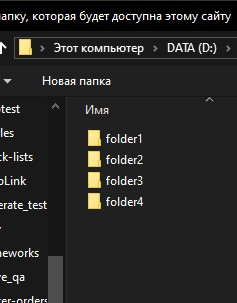
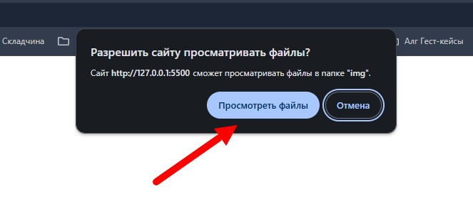
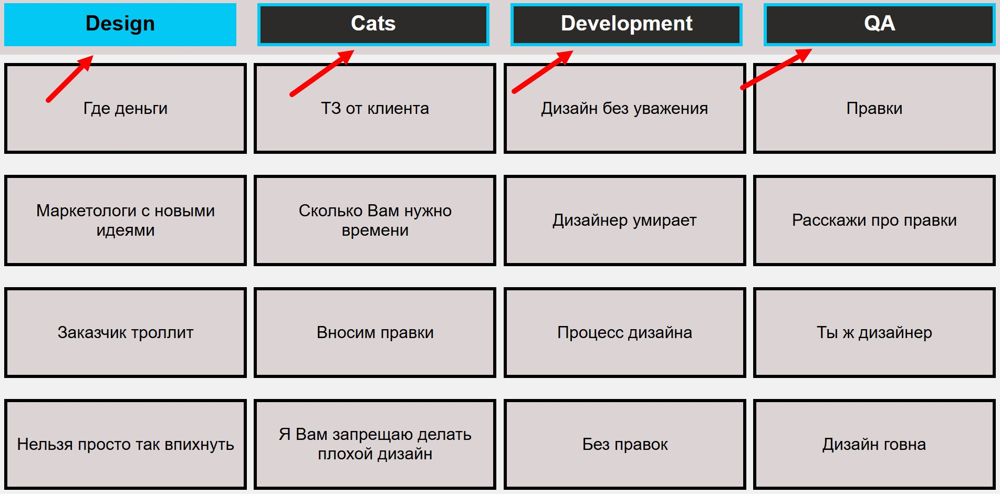
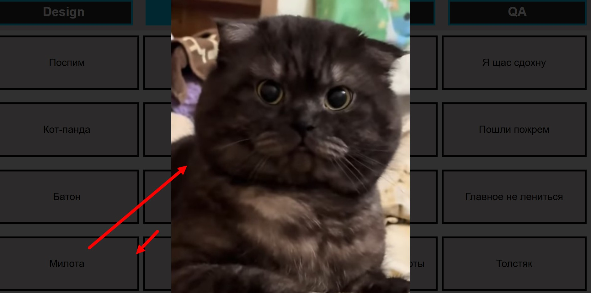

# Галерея (приложение для простого доступа к изображениям)  

## Описание:
Приложение позволяет пользователю выбрать директорию на диске с изображениями и организовать быстрый доступ к ним через web-интерфейс посредством кнопок на экране (пример использования в видео)

## Приложение можно использовать онлайн по ссылке:
https://a-gran.github.io/gallery/
  
### Я рекомендую скачаивать и использовать его offline, так как в онлайн-версии могут быть проблемы с доступом к файлам на диске и скоростью показа изображений.

## Установка для использования offline:  

### 1. Скачать репозиторий с приложением  

  
  

### 2. Скачать и установить vscode  

  
  

### 3. Установить в vscode расширение "Live Server (Five Server)"  

  
  

### 4. Открыть файл index.html в vscode и запустить сервер нажав на кнопку "Go Live" в правом нижнем углу  

  
  
  
### 5. В открывшемся в браузере окне приложения нажать на кнопку выбора основной папки  

  
  
  
### 6. В выпадающем окне браузера выбрать основную папку на диске с нужными подпапками изображений и нажать открыть  

  
  
  
### 7. Разрешить просмотр в браузере и продолжить работу с приложением
  
  
  
### 8. Можно переключаться по разделам в соответствии с названиями подпапок в основной папке
  
  
  
### 9. И просматривать изображения, кликая по кнопкам изображений
  
  
  
## Как правиль организовать папку с изображениями:
Скрипт сделан таким образом, что у нас есть основная папка img, в которой есть подпапки с изображениями. В подпапках могут быть изображения с любым расширением, но предпочтительно .jpg.

По умолчанию верстка рассчитана на 4 подпапки, если их будет больше, то кнопки будут добавляться в строку.
Также по умолчанию верстка рассчитана на 16 изображений в подпапке, если их будет больше, то изображения будут добавляться в столбик.

## Пример структуры папки с изображениями:
```
img
├─ folder1
│  ├─ image1.jpg
│  ├─ image2.jpg
│  └─ image3.jpg
├─ folder2
│  ├─ image4.jpg
│  ├─ image5.jpg
│  └─ image6.jpg
├─ folder3
│  ├─ image7.jpg
│  ├─ image8.jpg
│  └─ image9.jpg
├─ folder4
│  ├─ image10.jpg
│  ├─ image11.jpg
│  └─ image12.jpg
```

В верхней части интерфейса есть меню с названиями разделов. Названия автоматически подтягиваются из названий подпапок с изображениями.

Разделы состоят из кнопок, которые открывают изображения в модальном окне. Названия кнопок автоматически подтягиваются из имен файлов изображений при выборе основной папки, из которой лежат подпапки с изображениями.
