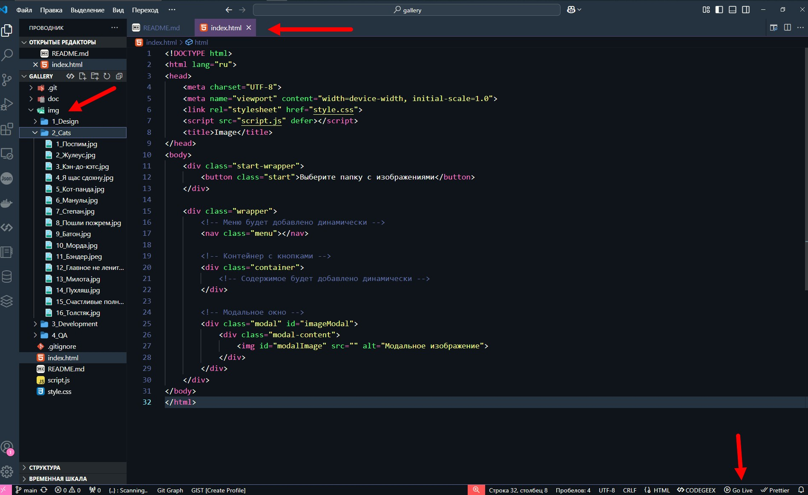
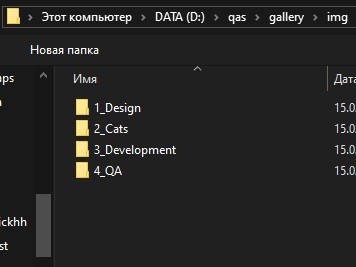

# Галерея (приложение для простого и быстрого просмотра изображений)  

## Описание:
Приложение позволяет пользователю выбрать директорию на диске с изображениями и организовать быстрый доступ к ним через web-интерфейс посредством кнопок на экране (пример использования в видео)

## Управление:
1. Клик по кнопке меню переключает подпапку с изображениями;
2. Клик по кнопке с названием изображения вызывает модальное окно с изображением на весь экран;
3. Escape скрывает модальное окно.

## Приложение можно использовать онлайн по ссылке, но предварительно нужно создать структуру папок с изображениями у себя на компьютере локально, чтобы использовать их для просмотра с помощью данного приложения:
### https://a-gran.github.io/gallery/
  
### Я рекомендую скачаивать и использовать его offline, так как в онлайн-версии могут быть проблемы с доступом к файлам на диске и скоростью показа изображений.

## Установка для использования offline:  

### 1. Скачать репозиторий с приложением  

  
  

### 2. Скачать и установить vscode  

  
  

### 3. Установить в vscode расширение "Live Server (Five Server)"  

  
  

### 4. Открыть файл index.html в vscode и запустить сервер нажав на кнопку "Go Live" в правом нижнем углу  

  
  
  
### 5. В открывшемся в браузере окне приложения нажать на кнопку выбора основной папки  

  
  
  
### 6. В выпадающем окне браузера выбрать основную папку на диске с нужными подпапками изображений и нажать открыть  

  
  
  
### 7. Разрешить просмотр в браузере и продолжить работу с приложением
  
  
  
### 8. Можно переключаться по разделам в соответствии с названиями подпапок в основной папке
  
  
  
### 9. И просматривать изображения, кликая по кнопкам изображений
  
  
  
## Как правильно организовать папку с изображениями:
Скрипт сделан таким образом, что у нас есть основная папка (по умолчанию img, но можно любое название), в которой есть подпапки с изображениями. В подпапках могут быть изображения с любым расширением, но предпочтительно .jpg.  

По умолчанию верстка рассчитана на 8 пунктов (подпапок) в одной строке.
Также по умолчанию верстка рассчитана на 16 изображений в подпапке, если их будет больше, то изображения будут добавляться в столбик. Я рекомендую ставить 12 изображений в подпапке, чтобы не было слишком длинных столбиков. На мой взгляд так легче воспринимать информацию.  

Добавление элементов меню происходит по номерам в начале названий подпапок в основной подпапке до знака нижнего подчеркивания.
Поэтому необходимо писать номер папки потом нижнее подчеркивание и название папки (например, 1_жучки, 2_котики и т.д.), тогда
названия папок будут отображаться, как элементы меню слева направо в порядке номеров.

Также необходимо ставить номера изображений в соответствующих папках (15_толстяк.jpg, 16_толстяк.jpg и т.д.), тогда
кнопки будут отображаться в порядке номеров в соответствующих подпапках.  


## Пример структуры папки с изображениями:
```
img
├─ 1_folder
│  ├─ 1_image.jpg
│  ├─ 2_image.jpg
│  └─ 3_image.jpg
|  ...
├─ 2_folder
│  ├─ 1_image.jpg
│  ├─ 2_image.jpg
│  └─ 3_image.jpg
|  ...
├─ 3_folder
│  ├─ 1_image.jpg
│  ├─ 2_image.jpg
│  └─ 3_image.jpg
|  ...
├─ 4_folder
│  ├─ 1_image.jpg
│  ├─ 2_image.jpg
│  └─ 3_image.jpg
|  ...
```

В верхней части интерфейса есть меню с названиями разделов. Названия автоматически подтягиваются из названий подпапок с изображениями.

Разделы состоят из кнопок, которые открывают изображения в модальном окне. Названия кнопок автоматически подтягиваются из имен файлов изображений при выборе основной папки, из которой лежат подпапки с изображениями.
